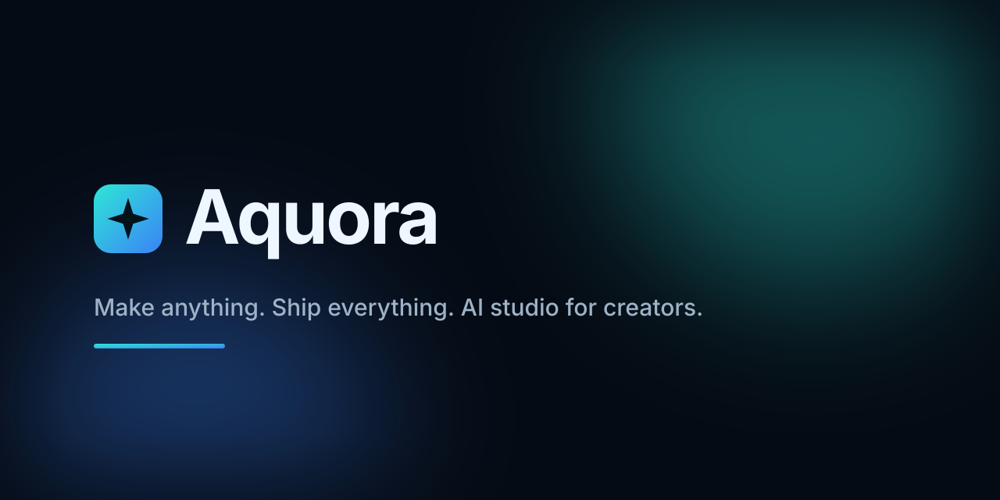

<p align="center">
  
</p>

<p align="center">   <a href="https://muapi.ai?utm_source=github&utm_medium=badge&utm_campaign=creator-agency"></a></p>

# Creator Agency

Make images, video, audio, lip-sync and AI personas in one place. Bring your own [MuAPI](https://muapi.ai?utm_source=github&utm_medium=readme&utm_campaign=creator-agency) key: no signup, no subscription.

Who it's for:

- **Creators and editors** who want every model in one tab instead of ten subscriptions.
- **Teams** who want to self-host it and own the stack.
- **Real-estate marketers** — the **Reelty** tab turns listing photos into tour videos, captions and ads.

## What's inside

| Studio | What it does |
|---|---|
| **Image** | Text-to-image and image-to-image across 100+ image models (Flux, Nano Banana, Seedream, Midjourney, GPT Image…), with multi-image reference input. |
| **Layers** | Layer-based editing: AI enhance, relight, 3D angle, text edits. |
| **Video** | Text-to-video and image-to-video (Kling, Sora, Veo, Wan, Seedance, Hailuo, Runway…). |
| **Audio** | Music and audio generation from a prompt. |
| **AI Clipping** | Pull highlights out of long video automatically. |
| **Motion Control** | Drive a character image with reference-video motion. |
| **Vibe Motion** | Motion graphics from text: kinetic type, charts, logo reveals. |
| **Lip Sync** | Portrait + audio → talking video, or video + audio → lip-synced video. |
| **Body Swap** | Recast the subject in any video with a target character image. |
| **Cinema** | Camera, lens, focal length and aperture controls turned into prompt modifiers. |
| **Marketing** | Product shots in, AI video ads out. |
| **Workflows** | Node-based builder for multi-step pipelines, with templates and a playground. |
| **Agents** | A conversational agent that plans and runs generation tasks. |
| **Design Agent** | Canvas-based autonomous design agent. |
| **Apps** | Ready-to-deploy app templates on the same model catalog. |
| **AI Influencer** | Consistent AI persona content. |
| **Reelty** | AI real-estate marketing studio, embedded as a tab. |

400+ models across image, video, audio and lip-sync, all through one MuAPI key.

The UI ships in English (`/`) and Simplified Chinese (`/zh`).

## Quick start

Needs Node.js 22 (see `.nvmrc`).

```bash
git clone --recurse-submodules https://github.com/hemantsatishjadhav06-ai/open-generative-ai.git
cd open-generative-ai

npm run setup   # installs deps + builds the workspace packages (required once)
npm run dev     # → http://localhost:3000
```

Already cloned without submodules? Run `git submodule update --init --recursive` once, then `npm run setup`.

Production build: `npm run build && npm run start`.

## Configuration

- **MuAPI key (required)** — the app asks for it on first launch. Grab one at [muapi.ai/access-keys](https://muapi.ai/access-keys?utm_source=github&utm_medium=readme&utm_campaign=creator-agency) and paste the key value (not its name). It's saved in your browser (`localStorage` plus a same-site cookie) and forwarded to MuAPI only through the app's own `/api` proxy — the server never stores it.
- **`NEXT_PUBLIC_REELTY_URL` (optional)** — URL of the Reelty deployment shown in the Reelty tab. Falls back to the hosted Reelty instance when unset. It is inlined at build time, so set it as a Railway service variable (the Dockerfile passes it through as a build arg).
- **`NEXT_PUBLIC_SITE_URL` (optional)** — public origin used for canonical/OG URLs, `robots.txt` and `sitemap.xml`. On Railway `RAILWAY_PUBLIC_DOMAIN` is used automatically; set this once a custom domain is attached.
- **`NEXT_PUBLIC_ANALYTICS_ENDPOINT` (optional)** — when set, client events are POSTed there via `sendBeacon` and its origin is added to the CSP `connect-src`; events are also available as `window.__ca_events` and the `ca:track` DOM event for any vendor snippet. Nothing is sent anywhere by default.

## Deploy

The app runs on **Railway** and builds from `main` with the included `Dockerfile` (`railway.json` pins the Dockerfile builder and a `/api/health` healthcheck) — push to `main` and Railway redeploys. The image runs Next's standalone server on Node 22. Set `NEXT_PUBLIC_REELTY_URL` in the service variables if you run your own Reelty.

Run it with Docker locally:

```bash
docker compose up --build   # → http://localhost:3001
```

## Desktop app

There's an Electron build with optional local inference (sd.cpp bundled, Wan2GP as a remote server):

```bash
npm run electron:dev            # run locally
npm run electron:build          # macOS
npm run electron:build:win      # Windows
npm run electron:build:linux    # Linux (AppImage + .deb)
```

Installers land in `release/`. Local models live in Electron's app-data folder, or wherever `CREATOR_AGENCY_LOCAL_AI_DIR` points (the legacy `OPEN_GENERATIVE_AI_LOCAL_AI_DIR` is still honored). On Apple Silicon the Metal `sd-cli` binary is downloaded at runtime from the upstream Open Generative AI GitHub release (github.com/Anil-matcha/Open-Generative-AI, tag `v1.0.3-binaries`); other platforms use the stock leejet/stable-diffusion.cpp release.

## Tests

```bash
npm test        # unit tests (proxies, locales, SSRF guard, analytics, local inference helpers)
npm run lint    # eslint (flat config in eslint.config.mjs)
```

## Project layout

```
app/                            Next.js App Router (en at /, zh at /zh)
components/                     StandaloneShell (nav, BYOK key modal, Reelty tab)
messages/                       Shell copy (en, zh)
packages/studio/                Studio components, model catalog, MuAPI client
packages/Vibe-Workflow/         Workflow engine (vendored)
packages/Open-Poe-AI/           Agents (vendored)
packages/Open-AI-Design-Agent/  Design agent (vendored)
electron/                       Desktop shell + local inference
```

## Credits

Creator Agency is built on [Open Generative AI](https://github.com/Anil-matcha/Open-Generative-AI) (MIT) by Anil Chandra Naidu Matcha and contributors; media generation runs on [MuAPI](https://muapi.ai?utm_source=github&utm_medium=readme&utm_campaign=creator-agency). Full third-party notices: [NOTICE.md](NOTICE.md).

## License

MIT — see [LICENSE](LICENSE) and [NOTICE.md](NOTICE.md).
