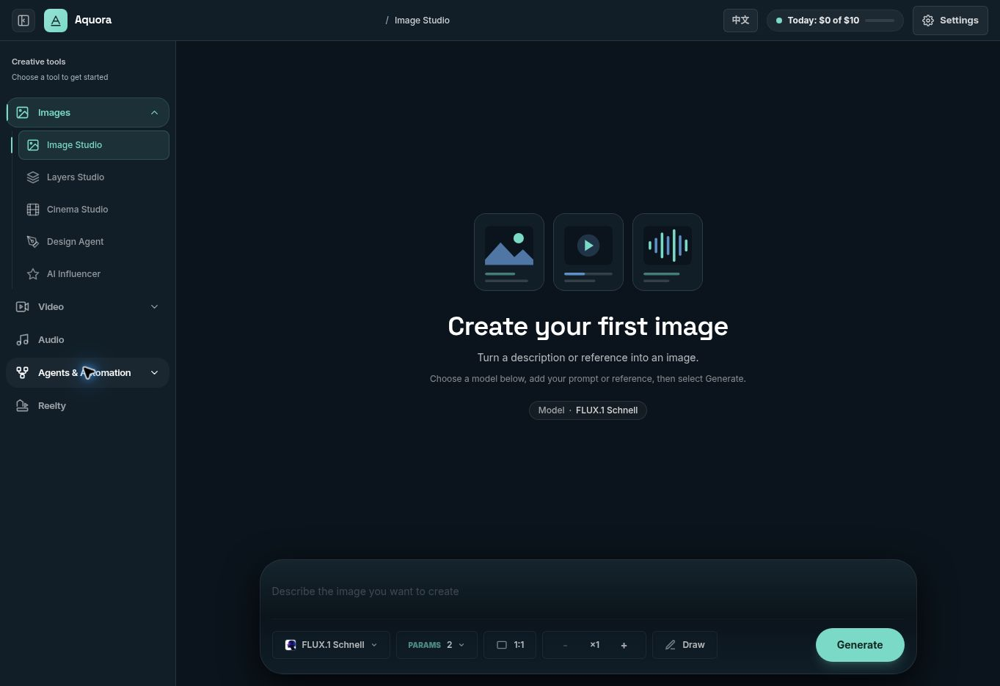

# Aquora deployment and launch verification

Deployment: 2026-09-30 UTC. Final live-provider recheck: 2026-10-01 UTC.

**Deployment completed successfully, and representative real-provider smoke tests now pass. Suitable for a monitored, limited beta; hold broad customer launch until backup/restore and restart-safe multi-step processing are addressed or their limits explicitly accepted.** The deployed branding and core application regressions are verified. Successful samples confirm access to the selected models at the time of testing; they do not certify every catalog model or guarantee future provider availability.

## Released version

- Production: https://open-generative-ai-production-4eaf.up.railway.app/
- Merged PR: https://github.com/hemantsatishjadhav06-ai/open-generative-ai/pull/1
- Production commit: `13457fa6783406e223d94ee23901d7d35d153712`.
- Verified source tree: `34885d5871d64a91ccdee374e0e6de367282e2a6`. The merged commit has exactly the same tree as the tested PR head `914853a25f6b7dd6adc9056c03d26f0a79b31388`.
- Final pre-merge Node 22 CI: https://github.com/hemantsatishjadhav06-ai/open-generative-ai/actions/runs/36751127939 — success.
- Merged-main CI: https://github.com/hemantsatishjadhav06-ai/open-generative-ai/actions/runs/36751908133 — success.
- Railway deployment: `787f408d-195a-46c3-a144-6ee83ef05fb8` — SUCCESS. Container startup observed at 17:33:49 UTC.
- `/api/health` returns the exact merged commit, `ok: true`, `gate: open`, `storage: persistent`, and configured fal/OpenRouter flags.

The user authorized deployment in the follow-up request. The prior [pre-launch audit](prelaunch-audit.md) describes the earlier, unmerged state; this report records subsequent verification and deployment.

## Final recheck fixes

The release includes the original budget, job recovery, request identity, cancellation correctness, authorization, session and agent navigation fixes plus the Aquora UI redesign. Two additional findings were fixed during the launch recheck:

1. Model discovery previously treated missing metadata as permission to show all historical models. Unknown availability now hides unverified choices; media studios show an explicit loading/error state with a retry. Discovery has a ten-second timeout. New browser tests verify a failed request and a slow request cannot expose generation controls before metadata is ready, and retry does not submit a job.
2. Embedded Design Studio rendered a second main landmark. It now preserves the host's single main landmark. The route regression waits for the real canvas heading and message input, avoiding a false pass against the loading placeholder.

## Verification results

| Check | Result | Evidence |
|---|---|---|
| Unit and gateway regression | 411 passed, zero failed/skipped | [Test log](release-evidence/tests.txt), final CI |
| Browser regression on production build | 44 passed, zero failed, 3.0 minutes locally | [Browser log](release-evidence/browser.txt), final CI |
| Build | All four workspace builds and Next production build passed locally and in CI; Railway Docker build passed | [Build log](release-evidence/build.txt) |
| Lint | Zero errors, 56 existing warnings | [Lint log](release-evidence/lint.txt) |
| Touched Design Studio package | Targeted lint: zero errors, ten existing warnings | Local targeted lint; package is otherwise outside the baseline lint scope |
| Catalog freshness | Passed | CI |
| Fresh production dependency advisory audit | Zero reported advisories | [Production dependency audit](release-evidence/production-dependencies.json) |
| Full dependency audit | 16 advisories: 1 critical, 14 high, 1 moderate; Electron/build/Vite tooling | [Full dependency audit](release-evidence/all-dependencies.json) |
| Deployed routes/assets | 27/27 expected HTTP responses, including intentional 404 | [Live route matrix](release-evidence/live-routes.json) |
| Release identity and storage | Health commit matches; persistent storage reported | [Production checks](release-evidence/production-checks.json) |
| Session/document survival | Isolated QA visitor session and workflow survived the real deployment | [Production checks](release-evidence/production-checks.json) |
| QA cleanup | Only the test workflow created for this check was deleted; read-back returned 404 | [Production checks](release-evidence/production-checks.json) |
| Real fal and OpenRouter integration | Image, video, audio, upload, fast text, agent-purpose text and vision passed on October 1 | [Provider evidence](release-evidence/provider-smoke-2026-10-01.json) |

Browser regression covers all 15 studio mounts, complete Image/Video/Audio/Agent/Workflow journeys with local provider fixtures, pending-job refresh recovery, duplicate prevention, session expiry, workspace privacy, failed logout, transient polling errors, validation, mobile navigation and localized routes. It is not exhaustive across every model or specialist canvas combination, and is not a complete accessibility certification.

## Real-provider verification — October 1

The user approved the proposed $1 total allowance and one public test-image upload in the follow-up. Tests used a fresh isolated visitor workspace, synthetic prompts and the repository's public icon. All calls went through the deployed Aquora gateway using its configured providers. No credits or subscriptions were purchased. The production commit remained `13457fa6783406e223d94ee23901d7d35d153712`; Railway still reported SUCCESS with no staged work and the persistent volume attached.

| Journey | Selected provider/model | Verified result |
|---|---|---|
| Image | fal / FLUX.1 Schnell | Completed; downloaded and visually inspected 512 × 512 JPEG showing the requested cup. |
| Video | fal / Seedance 1.0 Pro Fast | Completed; downloaded and decoded H.264, 864 × 480, 24 fps, 2.04 seconds; sampled frame shows the requested paper boat. |
| Audio | fal / MMAudio V2 text-to-audio | Completed; downloaded and fully decoded a non-silent 44.1 kHz mono MP3, 2.06 seconds. No subjective listening certification. |
| Upload | Aquora → fal storage | Public 2,964-byte PNG uploaded, fetched back successfully, and matched its source byte-for-byte. |
| Fast text | OpenRouter / `openai/gpt-6-luna` | HTTP 200, exact requested `Aquora QA OK` response, normal stop. |
| Agent-purpose text | OpenRouter / `anthropic/claude-sonnet-5` | HTTP 200, exact requested response, normal stop. This verifies the model route, not a second real-provider agent tool workflow. |
| Vision | OpenRouter / `google/gemini-3.8-flash` | Read the uploaded icon and returned a complete, accurate one-sentence description with normal stop. |

Media completion was observed 27, 39 and 141 seconds after initiating the respective image, video and audio probes. These are wall-clock observations including this audit's polling intervals and network overhead, not provider latency benchmarks. No ambiguous paid request was automatically resubmitted.

Aquora recorded **$0.253062** in the test workspace: $0.25 in conservative media estimates plus metered OpenRouter usage. This is the application's ledger, not a reconciled fal invoice. Current fal pricing and schemas were checked before generation; the selected media settings had substantial margin below the $1 limit. The verified [Seedance pricing formula](https://fal.ai/models/fal-ai/bytedance/seedance/v1/pro/fast/text-to-video) uses dimensions, frame rate and duration. Provider invoices remain outside this check.

Two harness adjustments are recorded explicitly: the first audio URL omitted encoding for the slash-containing model key and was rejected with 404 before dispatch; the corrected URL matched the studio client's encoding and succeeded. The first vision probe's 256-token ceiling truncated its answer; one separate 1,024-token probe completed. Both vision charges are included above. Neither adjustment required an application change.

Fresh Chrome checks confirmed the Aquora workspace, navigation and generation controls loaded and an empty prompt showed the expected validation notice. The [sampled Railway log summary](release-evidence/provider-runtime-summary.json) recorded successful provider calls, no 5xx responses, the expected redirect and the harness 404. This is a sampled interval, not continuous monitoring.

[Downloaded audio sample](release-evidence/provider-audio.mp3). Exact output metadata, hashes and public provider URLs are in the [machine-readable smoke evidence](release-evidence/provider-smoke-2026-10-01.json). Session cookies and signed job tokens are excluded. The isolated QA session was signed out successfully; an attempt to read its completed image job after logout returned 404, preserving session-bound job privacy.

## Live experience and branding

Aquora is the established product brand; Open Generative AI remains the repository name. The deployed public landing, studio, icon assets, manifest, titles and social-sharing image use the reviewed identity. The fresh manifest reports theme color `#0b141c` and the revised product description without the old unconditional model-count claim. The landing's new headline and correct production canonical origin were verified directly.

The intended design uses Inter/Space Grotesk, a light public landing, dark media workspaces, turquoise primary controls, clearer task entry points and explicit guidance about device-local history and estimated usage. The editable [Figma proposal](https://www.figma.com/design/5GVn4DlY1vo3ngNHgpPm05) remains available for design review.

Live Chrome checks confirmed:

- Image Studio and the updated navigation/brand loaded after deployment.
- Model search/selection worked and retained the selected model through Image → Video → Audio → back navigation.
- Empty image input displayed the expected validation message without generating anything.
- Settings clearly explained visitor workspace ownership, device-local history and the daily budget.
- Escape dismissed Settings and returned keyboard focus to its trigger.
- Video and Audio controls loaded successfully.
- Captured browser warning/error entries were extension metadata messages; none were application errors in the inspected sample.

## Railway facts verified with account access

The existing production service remains connected to this repository's `main` branch. It has one instance in `us-west2` and a 5 GB volume at `/data`; there were no unrelated staged configuration changes. No provider secrets were displayed or changed. OAuth exposes variable names rather than secret values.

Actual build logs confirm the repository Dockerfile, Node 22 Alpine, locked dependency installation, package builds and Next standalone output. Startup logs show the volume mounted, the server listening on `0.0.0.0:8080`, and readiness in 96 ms. The configuration file sets `/api/health`, a 60-second deployment healthcheck timeout and an ON_FAILURE restart policy. Railway marked this deployment SUCCESS.

The post-deployment sampled HTTP logs contained successful requests plus the intentional invalid-route 404; no 5xx was present in that sample. This is a point-in-time verification, not continuous uptime monitoring. The mounted-volume test proves survival of the QA document across this deployment, not backup/restore readiness or permanent media retention.

## Remaining launch conditions

1. **Provider coverage is representative.** The authorized real-provider checks above passed, clearing the earlier credential/output smoke-test condition. They cover one model per media category and the three configured LLM purposes. All enabled catalog models, advanced tool combinations and real-provider multi-step workflows have not been exercised. A catalog entry's presence or deprecated status is not proof of live account entitlement or ongoing availability.
2. **Backup and restore have not been verified.** Confirm a backup schedule and restore test before relying on the JSON volume for customer content.
3. **Active multi-step jobs are process-local.** A deploy/restart can interrupt agent/workflow/design pipelines; the implementation has no durable worker queue or shared coordination. Keep one instance and avoid promising uninterrupted multi-step jobs. Browser recovery of direct media jobs does not remove this architectural limit.
4. **Content retention is limited.** Core media history is stored on the current device. Generated files are provider CDN URLs, not an application-owned permanent archive. Visitor workspace recovery depends on the browser session.
5. **Desktop and separate services remain outside web launch certification.** Do not release Electron installers on the strength of this web verification; the full dependency audit still lists desktop/build advisories. Reelty's independent backend was not regression-certified here. Core media has no Cancel control in its UI despite backend cancellation support.

No customer content was modified and no load test ran. The September 30 persistence fixture was cleaned up. October 1 generated media, one uploaded public icon and the isolated QA usage ledger are test artifacts; provider-hosted files were not claimed to be deleted. No credits or subscriptions were purchased. This verification does not promise an issue-free customer launch.
